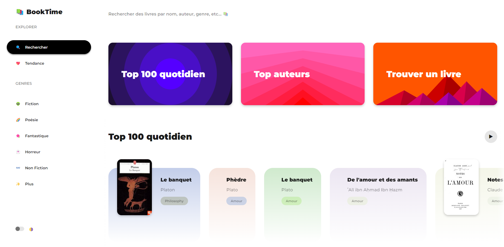

# BookTime

 <h1>Trouvez des livres en utilisant la base de données du Google Play Books.</h1>

Ceci est une traduction d'un projet nommé Booklix (ainsi que quelques améliorations) :

## 🏁 Introduction

Bookflix est un site Web sur lequel vous pouvez profiter et explorer le monde des livres - avec vos amis et dans le confort de votre navigateur !

Bookflix est une plateforme sociale, ainsi qu'un site dédié aux livres, conformément à notre slogan - Bookflix vous offre les plaisirs suivants :-

1. Rechercher des livres par titre, sujet et isbn, et afficher les informations qui leur sont associées, telles qu'une brève description, des livres similaires, des versions publiées.
2. Bookflix vous permet de publier des critiques sur des livres et de les noter, qui sont ensuite stockées dans nos propres bases de données.
3. Sur Bookflix, vous pouvez suivre d'autres utilisateurs pour voir quels livres ils lisent et être averti chaque fois qu'ils publient une critique.

Veuillez noter que nous utilisons l'API Google Livres pour obtenir certaines informations sur les livres et permettre aux utilisateurs de les lire. Par conséquent, ces fonctionnalités peuvent ne pas être disponibles à elles seules pour tous les livres.

## 💻 Usage

Rendez-vous tout simplement sur notre site Web - [BookTime]([https://wedone.github.io/BookTime/](https://wedoneofficiel.github.io/Boot-projets-Wedone-Officiel/BookTime/)). Vous serez instantanément accueilli par la page d'accueil, où vous pourrez rechercher des livres par titre, par sujet, ou explorer par genre ou par livres classés quotidiennement.

<h3 allign="center">BookTime - Explorez le monde des livres avec vos amis ! </h3>
